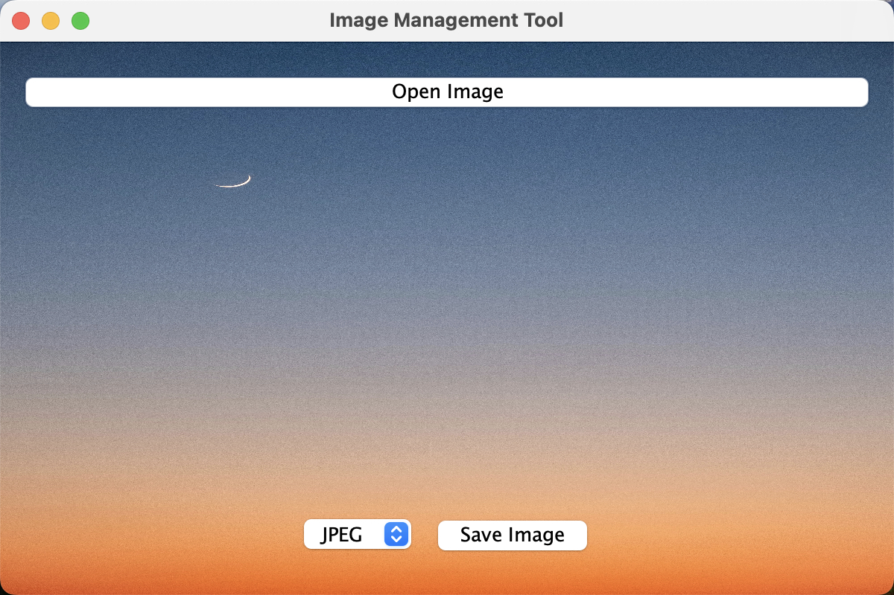
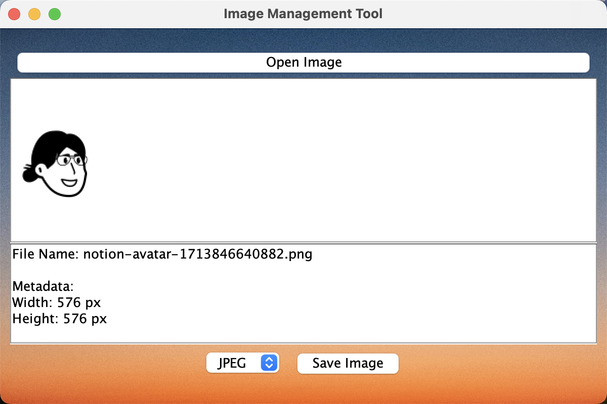
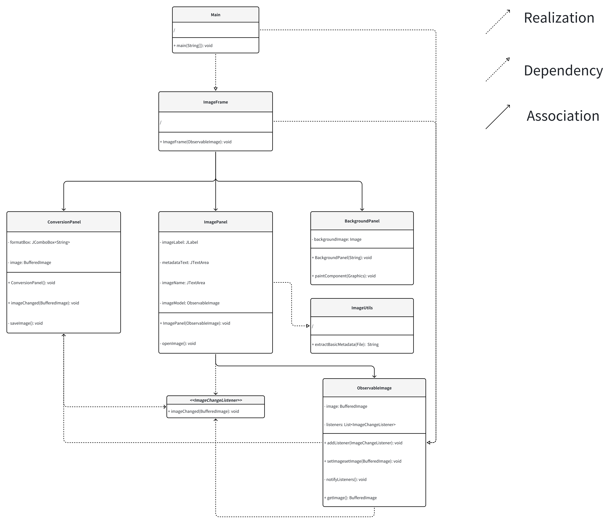

# Image Management Tool

This Java application provides a simple yet powerful image management tool using Java Swing. It allows users to load images from their system, view details, apply conversions, and save them in various formats.

## Features

- **Load Images**: Browse and load images from your local file system.
- **Display Metadata**: View image metadata such as dimensions and file type.
- **Convert Images**: Convert images to different formats (JPEG, PNG, BMP, JPG).
- **Save Images**: Save the converted images back to the local file system.
- **Observer Pattern**: Implements the Observer pattern for updating conversion options based on the image loaded.

## Application Screenshot

Here is a screenshot of the Image Management Tool in action:



## Prerequisites

Before you can run this application, you need to have the following installed:
- Java Development Kit (JDK) 11 or higher
- Any IDE that supports Java and Maven (e.g., IntelliJ IDEA, Eclipse)

## Installation

Clone the repository to your local machine:

```bash
git clone https://github.com/xiangxichen26/INFO5100_002296801_XiangxiangChen.git
cd imageManagementTool
```

## Run the project
To run the application, navigate to the project directory in your terminal, and execute:
```bash
java -jar imagemanagementtool.jar
```
Alternatively, you can run the project directly from your IDE by importing it as a Maven project and running the Main class.The path of the main class is
```angular2html
FinalProject/imageManagementTool/src/main/java/org/example/imagemanagementtool/Main.java
```

## Usage
Start the Application: Run the application using the above instructions.
Load an Image: Click on 'Open Image' and select an image from your file system.
View and Convert: Choose a format from the dropdown and click 'Save Image' to convert and save the image.

## Architecture
This project uses the following classes:

1. Main: Entry point of the application.
2. ImageFrame: Main application window.
3. ImagePanel: Panel to handle image loading and display.
4. ConversionPanel: Panel to handle image conversion and saving.
5. ObservableImage: Subject class for observer pattern.
6. ImageChangeListener: Interface for observer pattern.
7. BackgroundPanel：Panel to set background image.

The diagram is as bellow:


## Requirements CheckList
1. Class Diagram: 
- final_project_diagram.png 
2. Object-Oriented Principles:
- Inheritance:  ImagePanel, BackgroundPanel, ConversionPanel extends JPanel and ImageFrame extends JFrame.
- Encapsulation: fields in classes are private and accessible via getter/setter methods.
- Interfaces: ImageChangeListener.java
3. Design Pattern:
- Subject (ObservableImage): An observable object that notifies observers about changes (e.g., image updates).
- Observer (ImageChangeListener): Interface that will be implemented by any class that needs to react to image changes (e.g., ConversionPanel).
4. Code Comments and Documentation: Use Javadoc standards for class and method comments.
5. Exception Handling: Have comprehensive try-catch blocks around all operations that might generate exceptions, such as file I/O operations and image processing, and provide meaningful error messages to the user.
6. Screenshots of various tests: test_screenshot/INFO 5100 final project test.pdf
